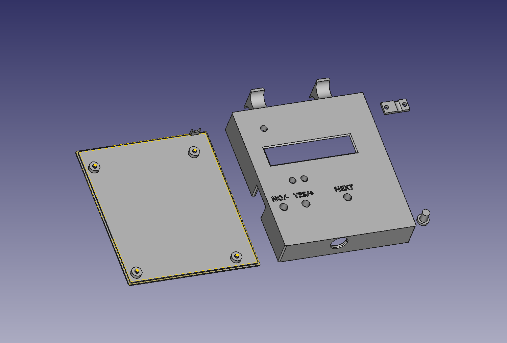
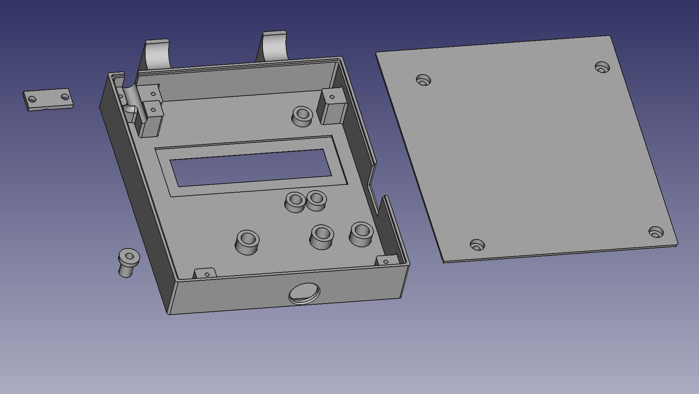

# JBCProg

This is an initial repository for a JBC programming tool.
So far, this repo contains only the case for the prototype board.
Please note this is my first attempt on using FreeCAD, so if there are any suggestions for improvement please let me know.
It should be printed using a 0.4mm nozzle, no support, but use brim.
The holes are exactly 6, resp. 5mm. Depending on your printer, manual correction with a drill may be necessary.

